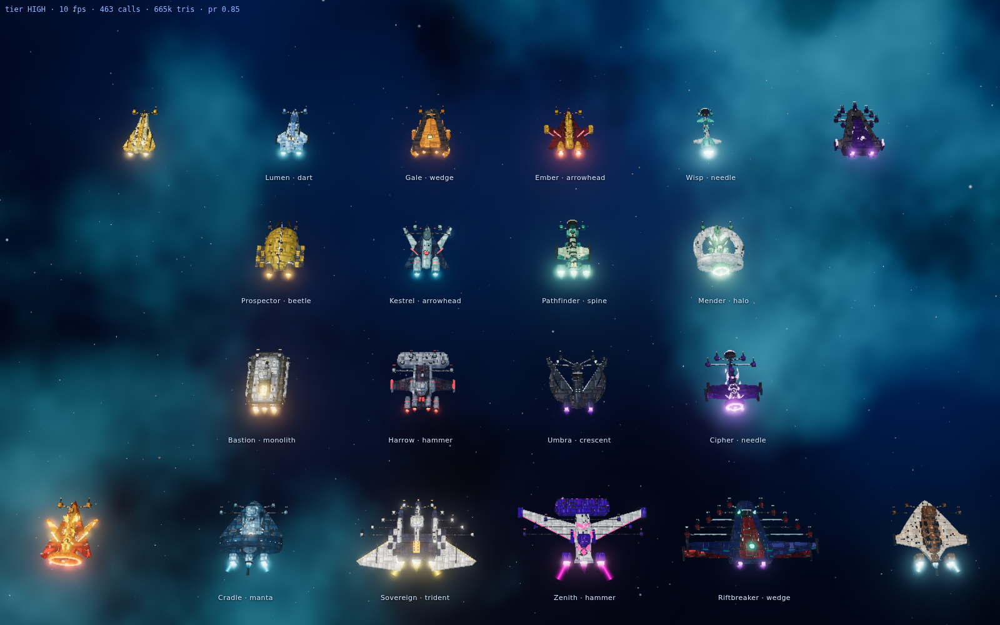
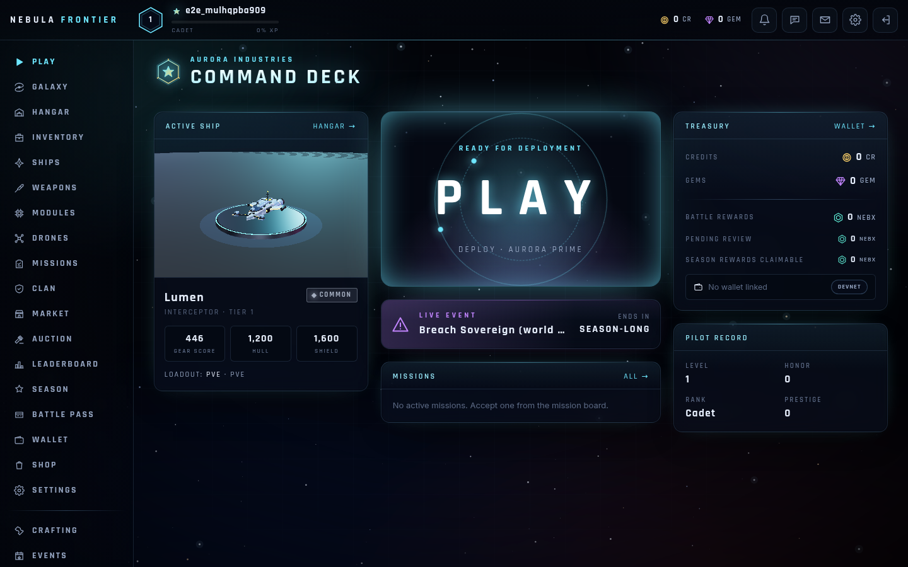
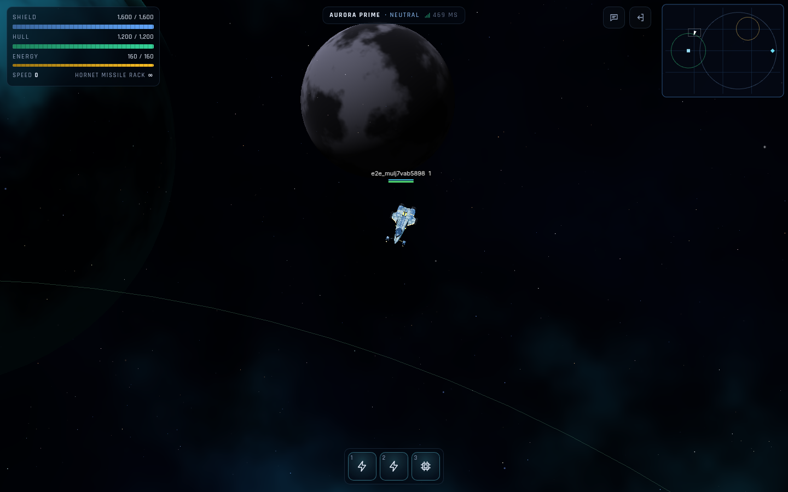

# NEBULA FRONTIER

An original persistent 3D space MMO for browser, Android and iOS. The game is server-authoritative, with PvP and PvE, bosses, raids, gates, mining, crafting, clans, a marketplace and auctions, seasons and a battle pass. It also has a Solana **devnet** reward economy backed by a double-entry ledger and a controlled treasury.

> Status and honest gaps: see [`docs/FINAL_IMPLEMENTATION_REPORT.md`](docs/FINAL_IMPLEMENTATION_REPORT.md) and [`docs/REQUIREMENTS_CHECKLIST.md`](docs/REQUIREMENTS_CHECKLIST.md).
> The economy is built around one rule: **player spending ≠ player profit**. See [`docs/ECONOMY.md`](docs/ECONOMY.md).

| Screen | |
|---|---|
| Procedural ships (16 distinct designs) |  |
| Command deck (desktop) |  |
| In game (desktop, live server) |  |

## Requirements
- Node.js ≥ 22 and pnpm 10 (`corepack enable`)
- PostgreSQL 16 and Redis 7 (local, or via Docker Compose)
- Optional:
  - a Solana wallet extension (Phantom, Solflare or Backpack) set to **devnet**;
  - Android SDK + JDK 21 for the Android build;
  - macOS + Xcode for the iOS build.

## Installation
```bash
cd nebula-frontier
pnpm install              # also runs `prisma generate`
cp .env.example .env      # fill in secrets (see "Environment")
```

### Repository setup (reference repos)
`pnpm repos:clone` clones the reference repositories into `tools/reference-repos/`. These clones are git-ignored and never bundled. How each one is used is in [`docs/REPOSITORIES.md`](docs/REPOSITORIES.md).

## Environment
All variables are documented in [`.env.example`](.env.example). At minimum:

| Variable | Purpose |
|---|---|
| `DATABASE_URL`, `REDIS_URL` | Postgres / Redis |
| `JWT_SECRET` (or `JWT_SECRETS` for rotation) | API access tokens |
| `GAME_TICKET_SECRET(S)` | Single-use game-server admission tickets |
| `INTERNAL_SERVICE_TOKEN` | API ↔ blockchain-service / game-server internal calls |
| `SOLANA_NETWORK=devnet`, `SOLANA_RPC_URL` | Devnet only |
| `TREASURY_PUBLIC_KEY`, `TREASURY_SECRET` | Treasury (the secret is used **only** by `apps/blockchain-service`, with `SERVICE_ROLE=blockchain`) |

Never commit `.env` or `.secrets/`; both are git-ignored.

## Database
```bash
pnpm db:migrate           # prisma migrate deploy
pnpm db:seed              # catalog, system ledger accounts, breakers, feature flags, dev admin
```
The dev admin is `admin@nebula.local` / `change-me-dev-only`. Set `ADMIN_EMAIL` and `ADMIN_PASSWORD` in any shared environment. Details are in [`docs/DATABASE.md`](docs/DATABASE.md).

## Redis
Redis holds presence, rate limits, single-use ticket keys, the BullMQ withdrawal queue and caches. Critical state always lives in Postgres.

## Running locally
```bash
pnpm dev                  # api :8080, game-server :2567, blockchain-service :8090, web :5173
pnpm --filter @nebula/admin dev   # admin :5174
```
Run each service on its own with `pnpm --filter @nebula/<api|game-server|blockchain-service|web> dev`.

| Service | Command | Health |
|---|---|---|
| API (Fastify) | `pnpm --filter @nebula/api dev` | `GET /health`, `/ready`, `/metrics` |
| Game server (Colyseus) | `pnpm --filter @nebula/game-server dev` | `GET /health`, `/ready`, `/metrics` |
| Dev bots | `pnpm --filter @nebula/game-server bots -- --count 10 --type fighter` | — |
| Web | `pnpm --filter @nebula/web dev` | http://localhost:5173 |

## Mobile (Capacitor)
```bash
pnpm mobile:sync                                  # web build + cap sync
cd apps/mobile/android && ./gradlew assembleDebug # Android APK (needs ANDROID_HOME)
npx cap open ios                                  # iOS (macOS + Xcode)
```
See [`docs/MOBILE.md`](docs/MOBILE.md) for deep links, universal/app links, push (FCM/APNs), secure storage and touch controls.

## Blockchain (devnet)
```bash
pnpm --filter @nebula/blockchain-service devnet:setup      # generate the treasury keypair into .secrets/ and write it into .env
# fund the treasury with devnet SOL (https://faucet.solana.com)
pnpm --filter @nebula/blockchain-service economy:bootstrap # fund ledger reserves from the REAL treasury balance
pnpm --filter @nebula/blockchain-service devnet:e2e        # real deposit + payout on devnet (prints tx signatures)
pnpm --filter @nebula/blockchain-service devnet:e2e:mock   # same flow against the local mock chain
```

### Wallet login
The flow is SIWS-style:
1. `POST /api/auth/nonce` returns a message.
2. The wallet signs it with `signMessage`.
3. `POST /api/auth/verify` checks the signature.
4. The API sets httpOnly session cookies.

Nonces are single-use and expire.

### Deposit
1. `POST /api/wallet/deposit/prepare` returns a memo.
2. The wallet sends a devnet transfer that includes the memo.
3. `POST /api/wallet/deposit/verify` checks network, mint, amount, recipient, memo, sender, confirmation and signature uniqueness, then credits the ledger.

### Withdrawal
1. `GET /api/wallet/withdraw/quote` shows the requested amount, service fee, network fee and final amount.
2. `POST /api/wallet/withdraw` applies limits, cooldown, review and a ledger hold.
3. The blockchain-service queue pays out, persists the signature and confirms on chain.

A withdrawal is never marked COMPLETED without on-chain confirmation. See [`docs/BLOCKCHAIN.md`](docs/BLOCKCHAIN.md).

## Admin
`apps/admin` (port 5174) covers operations dashboards, economy parameters (every change needs a reason and is audited), circuit breakers, the withdrawal and reward review queues, catalog and events, and owner profitability. Access is role-based: SUPER_ADMIN, ADMIN, MODERATOR, SUPPORT and ECONOMY_MANAGER.

## Testing
```bash
pnpm lint && pnpm typecheck
pnpm test                 # vitest: unit (parallel) + integration (sequential; needs Postgres + Redis)
npx vitest run tests/integration/vertical-slice.test.ts   # full MVP flow across API + game server + payout
cd tests && PLAYWRIGHT_CHROMIUM_PATH=/path/to/chrome npx playwright test -c e2e/playwright.config.ts   # web e2e (desktop + mobile)
pnpm economy:simulate     # writes docs/ECONOMY_SIMULATION.md and docs/ECONOMY_HEALTH_REPORT.md
```

## Docker
```bash
docker compose up --build   # postgres, redis, migrate+seed, api, game-server, blockchain-service, web (nginx :8088)
```
Behind a TLS-intercepting proxy, pass its CA as a BuildKit secret:

```bash
docker build --secret id=ca,src=ca.crt ...
```

## Production deployment
The target setup is Cloudflare, then nginx or a CDN for the static apps, a stateless API tier, and horizontally scaled game servers using Redis presence and driver. `blockchain-service` runs as a single active worker and is the only process that holds the treasury key; in production that key should live in a KMS. Postgres uses PITR. See [`docs/DEPLOYMENT.md`](docs/DEPLOYMENT.md), [`docs/SECURITY.md`](docs/SECURITY.md) and [`docs/ARCHITECTURE.md`](docs/ARCHITECTURE.md).

## Documentation
[Architecture](docs/ARCHITECTURE.md) · [Game design](docs/GAME_DESIGN.md) · [Networking](docs/NETWORKING.md) · [Database](docs/DATABASE.md) · [Blockchain](docs/BLOCKCHAIN.md) · [Economy](docs/ECONOMY.md) · [Security](docs/SECURITY.md) · [Mobile](docs/MOBILE.md) · [Deployment](docs/DEPLOYMENT.md) · [Repositories](docs/REPOSITORIES.md) · [Economy simulation](docs/ECONOMY_SIMULATION.md) · [Economy health](docs/ECONOMY_HEALTH_REPORT.md)
